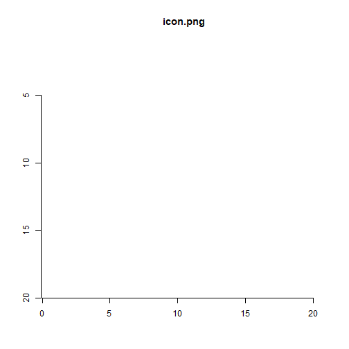

The 'pbixr' package enables one to access data and metadata from ['Microsoft' 'Power BI'](https://web.archive.org/web/20191225013754/https://powerbi.microsoft.com/en-us/why-power-bi/) documents: 'Power Query M' formulas and 'Data Analysis Expressions' ('DAX') queries and their properties, report layout and style, and data and data models.

'Microsoft' 'Power BI' is a big deal -- more than 200,000 organisations in 205 countries were reported as using it in [February 16, 2017](https://web.archive.org/web/20170906094058/https://powerbi.microsoft.com/en-us/blog/gartner-positions-microsoft-as-a-leader-in-bi-and-analytics-platforms-for-ten-consecutive-years/).

With extensive use of 'Power BI' and production of '.pbix' files, managing and analysing '.pbix' files can be challenging for individuals and organisations.

The `pbixr` package in R has several functions that can help.

# Usage

The sample '.pbix' used to demonstrate features of `pbixr` came from an [online 'Power BI' tutorial](https://web.archive.org/web/20170325143253/https://sqlkover.com/open-source-power-bi-desktop-workshop/), stored [here](https://github.com/KoenVerbeeck/PowerBI-Course/raw/master/pbix/TopMovies.pbix).
It was available under an [MIT Licence](https://github.com/KoenVerbeeck/PowerBI-Course/blob/master/LICENSE).
Due to licencing, this package could not be demonstrated on other '.pbix' files available from: [MS](https://github.com/microsoft/powerbi-desktop-samples/tree/master/Monthly%20Desktop%20Blog%20Samples/2019),
[Devin Knight](https://devinknightsql.com/category/power-bi-custom-visuals/) and
[Adam Aspin](https://github.com/Apress/pro-power-bi-desktop), author of 'Pro Power BI Desktop'.


```r
# 'suppressMessages' is used to hide messages
suppressMessages(library(pbixr))

# Helpers for this vignette
suppressMessages(library(RCurl))
suppressMessages(library(ggplot2))
suppressMessages(library(ggraph))
suppressMessages(library(igraph))
suppressMessages(library(imager))
suppressMessages(library(tidyr))
```


```r
temp_dir <- file.path(tempdir(), "vig")
if (!dir.exists(temp_dir)) {
    dir.create(temp_dir)
}
sample_file_name <- "sample_vig.pbix"
path_file_sample <- file.path(temp_dir, sample_file_name)
parent_temp_dir <- dirname(temp_dir)
existing_file <- list.files(parent_temp_dir, pattern = sample_file_name, recursive = TRUE, 
    full.names = TRUE)
if (length(existing_file) == 0) {
    url_pt1 <- "https://github.com/KoenVerbeeck/PowerBI-Course/blob/"
    url_pt2 <- "master/pbix/TopMovies.pbix?raw=true"
    url <- paste0(url_pt1, url_pt2)
    req <- download.file(url, destfile = path_file_sample, mode = "wb")
} else {
    path_file_sample <- existing_file[1]
}

# Licence ----------------------------------------------------------------------
# Licence associated with the sample .pbix file

# MIT License Copyright (c) 2017 KoenVerbeeck Permission is hereby granted, free
# of charge, to any person obtaining a copy of this software and associated
# documentation files (the 'Software'), to deal in the Software without
# restriction, including without limitation the rights to use, copy, modify,
# merge, publish, distribute, sublicense, and/or sell copies of the Software, and
# to permit persons to whom the Software is furnished to do so, subject to the
# following conditions: The above copyright notice and this permission notice
# shall be included in all copies or substantial portions of the Software.  THE
# SOFTWARE IS PROVIDED 'AS IS', WITHOUT WARRANTY OF ANY KIND, EXPRESS OR IMPLIED,
# INCLUDING BUT NOT LIMITED TO THE WARRANTIES OF MERCHANTABILITY, FITNESS FOR A
# PARTICULAR PURPOSE AND NONINFRINGEMENT. IN NO EVENT SHALL THE AUTHORS OR
# COPYRIGHT HOLDERS BE LIABLE FOR ANY CLAIM, DAMAGES OR OTHER LIABILITY, WHETHER
# IN AN ACTION OF CONTRACT, TORT OR OTHERWISE, ARISING FROM, OUT OF OR IN
# CONNECTION WITH THE SOFTWARE OR THE USE OR OTHER DEALINGS IN THE SOFTWARE.
```

# Analysis

Several types of questions were explored with `pbixr`.

## Metadata

### What was in the sample?

`f_get_pbix_info` was used to see the contents of the sample.


```r
# File path of the sample
input_pbix <- path_file_sample
pbi_content <- f_get_pbix_info(input_pbix)
pbi_content_names <- pbi_content$Name
# Identify exentsions
pbi_content_types <- unique(tools::file_ext(pbi_content_names))
# Show content Make the size look pretty
biggest_file <- max(pbi_content$Length)
pbi_content$Length <- prettyNum(pbi_content$Length, big.mark = ",")
knitr::kable(pbi_content)
```


|Name                                                                                                                               |Length    |Date                |
|:----------------------------------------------------------------------------------------------------------------------------------|:---------|:-------------------|
|Version                                                                                                                            |8         |2017-05-22 16:37:00 |
|[Content_Types].xml                                                                                                                |759       |2017-05-22 16:37:00 |
|DataMashup                                                                                                                         |45,654    |2017-05-22 16:37:00 |
|DataModel                                                                                                                          |1,486,848 |2017-05-22 16:37:00 |
|Report/Layout                                                                                                                      |2,795,666 |2017-05-22 16:37:00 |
|Settings                                                                                                                           |12        |2017-05-22 16:37:00 |
|Metadata                                                                                                                           |990       |2017-05-22 16:37:00 |
|Report/LinguisticSchema                                                                                                            |3,008     |2017-05-22 16:37:00 |
|DiagramState                                                                                                                       |2,394     |2017-05-22 16:37:00 |
|Report/CustomVisuals/ImgViewerVisual1455487926945/package.json                                                                     |1,150     |2017-05-22 16:37:00 |
|Report/CustomVisuals/ImgViewerVisual1455487926945/resources/icon.png                                                               |408       |2017-05-22 16:37:00 |
|Report/CustomVisuals/ImgViewerVisual1455487926945/resources/ImgViewerVisual.js                                                     |14,671    |2017-05-22 16:37:00 |
|Report/CustomVisuals/ImgViewerVisual1455487926945/resources/ImgViewerVisual.css                                                    |679       |2017-05-22 16:37:00 |
|Report/CustomVisuals/LongTextViewer1453740445633/package.json                                                                      |835       |2017-05-22 16:37:00 |
|Report/CustomVisuals/LongTextViewer1453740445633/resources/LongTextViewer1453740445633.pbiviz.json                                 |591,274   |2017-05-22 16:37:00 |
|Report/CustomVisuals/PBI_CV_9053509D_D461_463A_B485_CE9F6AB0F13C/package.json                                                      |752       |2017-05-22 16:37:00 |
|Report/CustomVisuals/PBI_CV_9053509D_D461_463A_B485_CE9F6AB0F13C/resources/PBI_CV_9053509D_D461_463A_B485_CE9F6AB0F13C.pbiviz.json |24,938    |2017-05-22 16:37:00 |
|SecurityBindings                                                                                                                   |294       |2017-05-22 16:37:00 |

The sample contained 18 files written on 22 May 2017.
The biggest file was 2,795,666 bytes.
The format of the files in the sample varied (xml, json, png, js, css).
The format of some these files was not easily identifiable because they didn't have a suffix (e.g., .png) -- they were likely to be compressed or (e.g., 'DataMashup') or a sub-directory (e.g., 'Report/Layout').

### What did the image in the sample look like?

`f_extract_images` was used to extract the only identifiable stand-alone image (i.e. an image not embedded in another file) in the sample.


```r
# Search only for .png files
image_reg <- "[.]png"
# Get the images
image_information <- f_extract_images(input_pbix, image_reg)
image_name <- gsub(".*/", "", image_information[[2]]$Name)
# Plot the first image
im <- imager::load.image(image_information[[1]])
plot(im, main = image_name)
```



### What did an image embedded in a .css file in the sample look like?

The sample included custom visuals, one of which contained an image. `f_get_pbix_fir`, the basis of `f_extract_images`, was used to help extract the image. This image appeared in the 'Visualisations' section of 'Power BI'.


```r
# Get the byte sequence of a first-level file.  The string is too long to fit
# nicely for this vignette so I will break it and paste it together.
variable_pt1 <- "Report/CustomVisuals/PBI_CV_9053509D_D461_463A_B485_"
variable_pt2 <- "CE9F6AB0F13C/resources/PBI_CV_9053509D_D461_463A_B485"
variable_pt3 <- "_CE9F6AB0F13C.pbiviz.json"
variable <- paste0(variable_pt1, variable_pt2, variable_pt3)
raw_img_viewer_visual <- f_get_pbix_fir(path_file_sample, variable)

# Write to a temporary file
temp_file_2 <- file.path(tempdir(), "pbiviz_1")
zz <- file(temp_file_2, "wb")
writeBin(raw_img_viewer_visual, zz)
close(zz)

# Read temporary file back in
char_img_viewer_visual <- readLines(temp_file_2, warn = FALSE)

# Get image data from the relvant line
image_img_viewer_visual <- gsub(");}", "", gsub(".*data:image/png;base64,", "", grep("data:image", 
    char_img_viewer_visual, value = TRUE)))

# Decode
raw_image_img_viewer_visual <- RCurl::base64Decode(image_img_viewer_visual, mode = "raw")

# Write to a temporary file
temp_file_3 <- file.path(tempdir(), "pbiviz_2.png")
zz <- file(temp_file_3, "wb")
writeBin(raw_image_img_viewer_visual, zz)
close(zz)

# Plot Get the name of custom visual for the main title
plot_title <- paste0("Visual: '", gsub(".*:\"", "", gsub("\", \"displayName.*", "", 
    char_img_viewer_visual)), "'")
# Load the image and create the plot
load_image_img_viewer_visual <- imager::load.image(temp_file_3)
plot(load_image_img_viewer_visual, main = plot_title)
```


### What Power Query M formulas were used in the sample?

'DataMashup' was a compressed file that included the Power Query M formulas in the sample. `f_get_dama_m` was used to extract them.


```r
# Get the query
m_query <- f_get_dama_m(input_pbix)
#> Error in f_get_dama_m(input_pbix): argument "remove_temp" is missing, with no default
# Show the first ten lines of the query
top_m <- paste0(head(m_query, 10), "\n")
#> Error in head(m_query, 10): object 'm_query' not found
```

The first ten steps of one of the Power Query M formulas looked like this:


```r
cat(top_m)
#> Error in cat(top_m): object 'top_m' not found
```

The 'DataMashup' file also included an .xml file, which contained metadata associated with the Power Query M formulas. `f_get_dama`, `f_get_dama_index`, `f_get_dama_file`,  `f_get_dama_xml_details` and `f_get_dama_xml` were used to access the .xml file in the DataMashup file and `f_get_dama_xml_data` was used to get the metadata of the Power Query M formulas.


```r
# Get details of .xml files included in the DataMashup file
xml_details <- f_get_dama_xml_details(input_pbix)
# Identify the start and end bytes of the .xml file we want from the DataMashup
# file
xml_start <- (xml_details[[1]][1]/2) + 1
xml_end <- xml_details[[3]][1]
# Get the desired .xml file from DataMashup file
input_xml <- f_get_dama_xml(input_pbix, xml_start, xml_end)
# Get metadata from the the desired .xml file
get_xml_data <- f_get_dama_xml_data(input_xml)
```

### What metadata existed for all Power Query M formula in the sample?

4 metadata variables existed for all Power Query M formulas.


```r
# Show content
knitr::kable(get_xml_data[[1]])
```


|query       |type                           |value     |
|:-----------|:------------------------------|:---------|
|AllFormulas |Relationships                  |sAAAAAA== |
|AllFormulas |QueryGroups                    |sAAAAAA== |
|AllFormulas |IsRelationshipDetectionEnabled |sFalse    |
|AllFormulas |RunBackgroundAnalysis          |sFalse    |

### What metadata existed for each Power Query M formula in the sample?


```r
# Show content of first query
show_first_query <- get_xml_data[[2]] %>% filter(query == "Section1/Actors%20Bridge")
knitr::kable(show_first_query)
```


|query                    |type                                        |value                                                                                                                                                                                                                                                                                                                                                                                                                                                                                                                                                                                                                                                                                                                                                                                                                                                                                                                                                                                                                                                                                                                                                                                                                                                                                                                                                                                                                                                                                                                                                                                                                                                                                                                                                                                                                                         |
|:------------------------|:-------------------------------------------|:---------------------------------------------------------------------------------------------------------------------------------------------------------------------------------------------------------------------------------------------------------------------------------------------------------------------------------------------------------------------------------------------------------------------------------------------------------------------------------------------------------------------------------------------------------------------------------------------------------------------------------------------------------------------------------------------------------------------------------------------------------------------------------------------------------------------------------------------------------------------------------------------------------------------------------------------------------------------------------------------------------------------------------------------------------------------------------------------------------------------------------------------------------------------------------------------------------------------------------------------------------------------------------------------------------------------------------------------------------------------------------------------------------------------------------------------------------------------------------------------------------------------------------------------------------------------------------------------------------------------------------------------------------------------------------------------------------------------------------------------------------------------------------------------------------------------------------------------|
|Section1/Actors%20Bridge |IsDirectQuery                               |l0                                                                                                                                                                                                                                                                                                                                                                                                                                                                                                                                                                                                                                                                                                                                                                                                                                                                                                                                                                                                                                                                                                                                                                                                                                                                                                                                                                                                                                                                                                                                                                                                                                                                                                                                                                                                                                            |
|Section1/Actors%20Bridge |NameUpdatedAfterFill                        |l1                                                                                                                                                                                                                                                                                                                                                                                                                                                                                                                                                                                                                                                                                                                                                                                                                                                                                                                                                                                                                                                                                                                                                                                                                                                                                                                                                                                                                                                                                                                                                                                                                                                                                                                                                                                                                                            |
|Section1/Actors%20Bridge |ResultType                                  |sTable                                                                                                                                                                                                                                                                                                                                                                                                                                                                                                                                                                                                                                                                                                                                                                                                                                                                                                                                                                                                                                                                                                                                                                                                                                                                                                                                                                                                                                                                                                                                                                                                                                                                                                                                                                                                                                        |
|Section1/Actors%20Bridge |BufferNextRefresh                           |l0                                                                                                                                                                                                                                                                                                                                                                                                                                                                                                                                                                                                                                                                                                                                                                                                                                                                                                                                                                                                                                                                                                                                                                                                                                                                                                                                                                                                                                                                                                                                                                                                                                                                                                                                                                                                                                            |
|Section1/Actors%20Bridge |FillColumnNames                             |s["Title","Actors"]                                                                                                                                                                                                                                                                                                                                                                                                                                                                                                                                                                                                                                                                                                                                                                                                                                                                                                                                                                                                                                                                                                                                                                                                                                                                                                                                                                                                                                                                                                                                                                                                                                                                                                                                                                                                                           |
|Section1/Actors%20Bridge |RelationshipInfoContainer                   |s{"columnCount":2,"keyColumnNames":[],"queryRelationships":[],"columnIdentities":["Section1/Actors Bridge/Unpivoted Columns.{Title,0}","Section1/Actors Bridge/Trimmed Text.{Actors,1}"],"ColumnCount":2,"KeyColumnNames":[],"ColumnIdentities":["Section1/Actors Bridge/Unpivoted Columns.{Title,0}","Section1/Actors Bridge/Trimmed Text.{Actors,1}"],"RelationshipInfo":[]}                                                                                                                                                                                                                                                                                                                                                                                                                                                                                                                                                                                                                                                                                                                                                                                                                                                                                                                                                                                                                                                                                                                                                                                                                                                                                                                                                                                                                                                                |
|Section1/Actors%20Bridge |LastAnalysisServicesFormulaText             |s{"IncludesReferencedQueries":true,"RootFormulaText":"let\n    Source = ExtraMovieInfo,\n    #\"Removed Other Columns\" = Table.SelectColumns(Source,{\"Actors\", \"Title\"}),\n    #\"Split Column by Delimiter\" = Table.SplitColumn(#\"Removed Other Columns\",\"Actors\",Splitter.SplitTextByDelimiter(\",\", QuoteStyle.Csv),{\"Actors.1\", \"Actors.2\", \"Actors.3\", \"Actors.4\"}),\n    #\"Reordered Columns\" = Table.ReorderColumns(#\"Split Column by Delimiter\",{\"Title\", \"Actors.1\", \"Actors.2\", \"Actors.3\", \"Actors.4\"}),\n    #\"Changed Type\" = Table.TransformColumnTypes(#\"Reordered Columns\",{{\"Actors.1\", type text}, {\"Actors.2\", type text}, {\"Actors.3\", type text}, {\"Actors.4\", type text}}),\n    #\"Unpivoted Columns\" = Table.UnpivotOtherColumns(#\"Changed Type\", {\"Title\"}, \"Attribute\", \"Actors\"),\n    #\"Removed Columns\" = Table.RemoveColumns(#\"Unpivoted Columns\",{\"Attribute\"}),\n    #\"Trimmed Text\" = Table.TransformColumns(#\"Removed Columns\",{{\"Actors\", Text.Trim}})\nin\n    #\"Trimmed Text\"","ReferencedQueriesFormulaText":{"ExtraMovieInfo":"let\r\n    Source = Csv.Document(File.Contents(\"D:\\SQLServer_Community\\Power BI Open Source Training\\ExtraMovieInfo.txt\"),[Delimiter=\"#(tab)\", Columns=17, Encoding=1252, QuoteStyle=QuoteStyle.None]),\r\n    #\"Use First Row As Headers\" = Table.PromoteHeaders(Source, [PromoteAllScalars=true]),\r\n    #\"Changed Type with Locale\" = Table.TransformColumnTypes(#\"Use First Row As Headers\", {{\"imdbRating\", type number}, {\"Released\", type date}}, \"en-US\"),\r\n    #\"Changed Type\" = Table.TransformColumnTypes(#\"Changed Type with Locale\",{{\"Runtime\", Int64.Type}, {\"Metascore\", Int64.Type}, {\"imdbVotes\", Int64.Type}})\r\nin\r\n    #\"Changed Type\""}} |
|Section1/Actors%20Bridge |IsLastAnalysisServicesFormulaTextCollection |l1                                                                                                                                                                                                                                                                                                                                                                                                                                                                                                                                                                                                                                                                                                                                                                                                                                                                                                                                                                                                                                                                                                                                                                                                                                                                                                                                                                                                                                                                                                                                                                                                                                                                                                                                                                                                                                            |
|Section1/Actors%20Bridge |LoadedToAnalysisServices                    |l1                                                                                                                                                                                                                                                                                                                                                                                                                                                                                                                                                                                                                                                                                                                                                                                                                                                                                                                                                                                                                                                                                                                                                                                                                                                                                                                                                                                                                                                                                                                                                                                                                                                                                                                                                                                                                                            |

### What steps existed for each Power Query M formula?


```r
# Show content of first query
knitr::kable(data.frame(step = grep("Section1/Actors%20Bridge", get_xml_data[[3]], 
    value = TRUE)))
```


|step                                                     |
|:--------------------------------------------------------|
|Section1/Actors%20Bridge                                 |
|Section1/Actors%20Bridge/Source                          |
|Section1/Actors%20Bridge/Removed%20Other%20Columns       |
|Section1/Actors%20Bridge/Split%20Column%20by%20Delimiter |
|Section1/Actors%20Bridge/Reordered%20Columns             |
|Section1/Actors%20Bridge/Changed%20Type                  |
|Section1/Actors%20Bridge/Unpivoted%20Columns             |
|Section1/Actors%20Bridge/Removed%20Columns               |
|Section1/Actors%20Bridge/Trimmed%20Text                  |

### What was the layout of the sample?

`f_read_layout` was used to read Layout in the Report sub-directory.


```r
gsub__1 <- paste0(".*sections")
gsub__2 <- "{\"id\":0,\"sections"
# Run the function
get_layout <- f_read_layout(path_file_sample, gsub__1, gsub__2)
#> An error occured reading without data exclusion. The file was read with data exclusion: gsub(".*sections","{"id":0,"sections", ...)
```

An encoding issue was encountered with Layout, which meant that some of the data in Layout was excluded so that it could be loaded into R.
This issue was investigated by unzipping the sample and opening 'Layout' in a text editor.

### What were the report names of the sample?


```r
computer_name <- get_layout$sections$name
human_name <- get_layout$sections$displayName
names <- data.frame(computer_name = computer_name, human_name = human_name)
names
#>     computer_name
#> 1   ReportSection
#> 2  ReportSection2
#> 3  ReportSection1
#> 4  ReportSection3
#> 5  ReportSection5
#> 6  ReportSection4
#> 7  ReportSection6
#> 8  ReportSection9
#> 9  ReportSection7
#> 10 ReportSection8
#>                  human_name
#> 1         OverviewTopMovies
#> 2           AnalysisByGenre
#> 3           AnalysisByRated
#> 4                Clustering
#> 5                TimeSlicer
#> 6  Grouping,CondForm&others
#> 7                   Binning
#> 8      Numericslicer+Matrix
#> 9                       DAX
#> 10            QuickMeasures
```

### Which reports included filters in the sample?


```r
json_sect <- get_layout$sections
visual_containers <- json_sect$visualContainers
filter_index <- which(unlist(lapply(lapply(lapply(visual_containers, function(x) colnames(x)), 
    function(z) grep("filters", z)), length)) > 0)
json_sect$displayName[filter_index]
#> [1] "AnalysisByGenre"         
#> [2] "Grouping,CondForm&others"
```

### Where were all the visual containers positioned in the first report of the sample?


```r
contain_df <- visual_containers[[1]]
plot(contain_df$x, contain_df$y * -1, main = paste0("Sheet: ", as.character(names[3, 
    2])), sub = "Top-left corner of box", pch = 3)
```


### What were the characteristics of one of the visual containers in the first report of the sample?


```r
jsonlite::prettify(contain_df[11, "dataTransforms"])
#> {
#>     "objects": {
#>         "TextScrollDetail": [
#>             {
#>                 "properties": {
#>                     "fontSize": {
#>                         "expr": {
#>                             "Literal": {
#>                                 "Value": "14D"
#>                             }
#>                         }
#>                     }
#>                 }
#>             }
#>         ]
#>     },
#>     "projectionOrdering": {
#>         "Category": [
#>             0
#>         ]
#>     },
#>     "queryMetadata": {
#>         "Select": [
#>             {
#>                 "Restatement": "Plot",
#>                 "Name": "IMDBTop250.Plot",
#>                 "Type": 2048
#>             }
#>         ]
#>     },
#>     "visualElements": [
#>         {
#>             "DataRoles": [
#>                 {
#>                     "Name": "Category",
#>                     "Projection": 0,
#>                     "isActive": false
#>                 }
#>             ]
#>         }
#>     ],
#>     "selects": [
#>         {
#>             "displayName": "Plot",
#>             "queryName": "IMDBTop250.Plot",
#>             "roles": {
#>                 "Category": true
#>             },
#>             "type": {
#>                 "category": null,
#>                 "underlyingType": 1
#>             },
#>             "expr": {
#>                 "Column": {
#>                     "Expression": {
#>                         "SourceRef": {
#>                             "Entity": "TopMovies"
#>                         }
#>                     },
#>                     "Property": "Plot"
#>                 }
#>             }
#>         }
#>     ]
#> }
#> 
```

## Data

Given that data wasn't identified elsewhere, 'DataModel' was the likely place that data was held.
The file started with `STREAM_STORAGE_SIGNATURE_)!@#$%^&*", which was consistent with a [[MS-XLDM]: Spreadsheet Data Model File Format](https://docs.microsoft.com/en-us/openspecs/office_file_formats/ms-xldm/8c62e8ce-f605-488d-81e9-4ecdb7686a52).

`pbixr` did not include a function to get data by reading 'DataModel'. However, it did include a function, `f_query_datamodel`, to access data via a local instance of 'Microsoft' 'Analysis Services'. `f_get_connections` was used to identify the port of the 'Analysis Services' connection. [This document](https://web.archive.org/web/20180819200620/http://biinsight.com/connect-to-power-bi-desktop-model-from-excel-and-ssms/) was considered helpful.
`f_query_datamodel` and `f_get_connections` required ['Microsoft' 'PowerShell'](https://en.wikipedia.org/wiki/PowerShell).

### What DAX formulas were used in the sample?

```r
connections_open <- f_get_connections() %>% mutate(pbix = gsub(" \\[Read-Only\\]", 
    "", gsub(" - Power BI Desktop", "", pbix_name))) %>% filter(pbix == gsub("[.]pbix", 
    "", basename(path_file_sample)))
correct_port <- as.numeric(connections_open$ports[1])
connection_db <- paste0("Provider=MSOLAP.8;Data Source=localhost:", correct_port, 
    ";MDX Compatibility=1")
# Expression to get the DAX queries
sql_measures <- paste0("select MEASURE_NAME, EXPRESSION, MEASUREGROUP_NAME ", "from $SYSTEM.MDSCHEMA_MEASURES")
# Query the analysis service
get_dax <- f_query_datamodel(sql_measures, connection_db)
# Display a result
t_data <- t(tail(get_dax, 1))
colnames(t_data) <- NULL
# To improve display of the DAX with kable, I removed new lines and tabs that
# occured in the DAX
knitr::kable(trimws(gsub("\\t", "", gsub("\\n", "", t_data))))
#> Warning in kable_markdown(x
#> = structure(c("MEASURE_NAME",
#> "EXPRESSION", : The table should have
#> a header (column names)
```


|                  |                                                                                                                                                                                                                                                                     |
|:-----------------|:--------------------------------------------------------------------------------------------------------------------------------------------------------------------------------------------------------------------------------------------------------------------|
|MEASURE_NAME      |imdbVotes running total in Title                                                                                                                                                                                                                                     |
|EXPRESSION        |CALCULATE(SUM('TopMovies'[imdbVotes]),FILTER(CALCULATETABLE(SUMMARIZE('TopMovies', 'TopMovies'[Rank], 'TopMovies'[Title]),ALLSELECTED('TopMovies')),ISONORAFTER('TopMovies'[Rank], MAX('TopMovies'[Rank]), DESC,'TopMovies'[Title], MAX('TopMovies'[Title]), DESC))) |
|MEASUREGROUP_NAME |TopMovies                                                                                                                                                                                                                                                            |

### How were the tables linked in the sample?


```r
# Get relationships
sql_relationships <- paste0("select FromTableID, FromColumnID, ToTableID,", " ToColumnID  from $SYSTEM.TMSCHEMA_RELATIONSHIPS")
get_relationships <- f_query_datamodel(sql_relationships, connection_db)

# Get names of columns
sql_columns <- "select * from $SYSTEM.TMSCHEMA_COLUMNS"
get_columns <- f_query_datamodel(sql_columns, connection_db) %>% mutate(ColumnName = ifelse(nchar(as.character(ExplicitName)) == 
    0, as.character(InferredName), as.character(ExplicitName))) %>% select(ColumnID = ID, 
    ColumnName)

# Get names of tables
sql_table <- "select * from $SYSTEM.TMSCHEMA_TABLES"
get_tables <- f_query_datamodel(sql_table, connection_db) %>% select(TableID = ID, 
    TableName = Name)

# Merge things together
get_relationship_names <- get_relationships %>% merge(get_tables, by.x = "FromTableID", 
    by.y = "TableID") %>% rename(FromTable = TableName) %>% merge(get_tables, by.x = "ToTableID", 
    by.y = "TableID") %>% rename(ToTable = TableName) %>% merge(get_columns, by.x = "FromColumnID", 
    by.y = "ColumnID") %>% rename(FromColumn = ColumnName) %>% merge(get_columns, 
    by.x = "ToColumnID", by.y = "ColumnID") %>% rename(ToColumn = ColumnName) %>% 
    select(FromTable, ToTable, FromColumn, ToColumn)

# Make things all characters drop table with long name. Doing this just for
# display purposes here.
get_relationship_names <- get_relationship_names[-5, ] %>% mutate(FromTable = as.character(FromTable)) %>% 
    mutate(ToTable = as.character(ToTable))

# Plot the results with igraph
c_list <- list()
for (i in 1:nrow(get_relationship_names)) {
    c_list[[i]] <- get_relationship_names[i, 1:2]
}
ed <- as.character(unlist(c_list))
# Use igraph, ggraph, ggplo2 to show preliminary example of data model
g1 <- igraph::graph(edges = ed, directed = F)
ggraph::ggraph(g1, layout = "stress") + ggraph::geom_edge_link() + ggraph::geom_node_point(size = 2, 
    col = "red") + ggraph::geom_node_text(ggplot2::aes(label = name)) + ggplot2::theme(panel.background = ggplot2::element_blank())
```


### What did one of the tables in the sample look like?


```r
query_topmovies <- "evaluate TopMovies"
get_data_topmovies <- f_query_datamodel(query_topmovies, connection_db)
# Display some results
knitr::kable(get_data_topmovies[1:3, 1:3])
```


| TopMovies.Rank.|TopMovies.Title.                               | TopMovies.Year.|
|---------------:|:----------------------------------------------|---------------:|
|               1|The Shawshank Redemption                       |            1994|
|               5|12 Angry Men                                   |            1957|
|              12|Star Wars: Episode V - The Empire Strikes Back |            1980|

# Modification

A cautious approach was used: modifications were saved to a new '.pbix', not over an existing '.pbix'. It was assumed that dependencies and certification could result in a corrupt '.pbix'.

### How was the size of the sample reduced?

The sample was unzipped with `f_unzip_pbix` and `f_clean_under_the_hood` was used to remove 'DataModel'.


```r
# Create a temporary, modified sample File
path_file_sample_mod <- file.path(temp_dir, "sample_modified.pbix")
if (file.exists(path_file_sample_mod)) {
    file.remove(path_file_sample_mod)
}
# Directory
dir_file_sample_mod <- file.path(temp_dir, "sample_modified")
if (file.exists(dir_file_sample_mod)) {
    unlink(dir_file_sample_mod, recursive = TRUE)
}

f_clean_under_the_hood(path_file_sample, dir_file_sample_mod, path_file_sample_mod)
unlink(dir_file_sample_mod, recursive = TRUE)

size_ori <- prettyNum(file.info(path_file_sample)$size, big.mark = ",")
size_mod <- prettyNum(file.info(path_file_sample_mod)$size, big.mark = ",")
```

With 'DataModel', the sample was 2,196,745 bytes. Without 'DataModel', the sample was 701,993 bytes.


Have fun!
